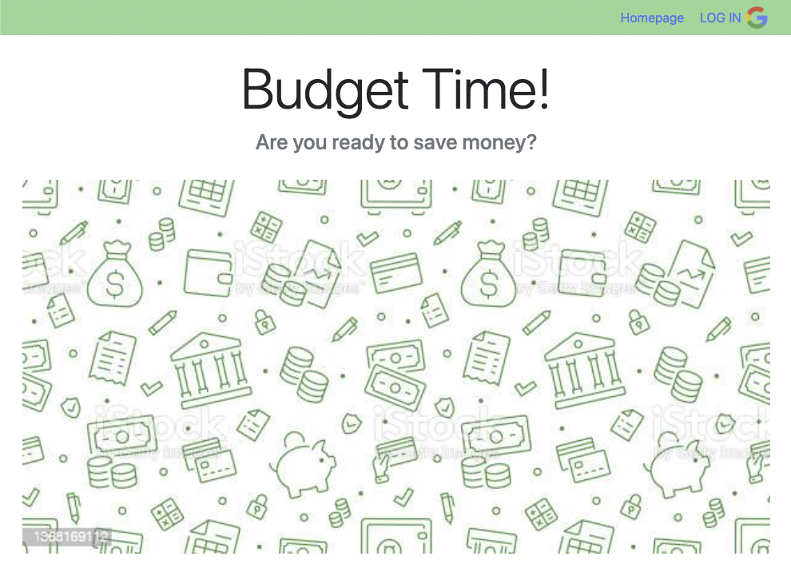
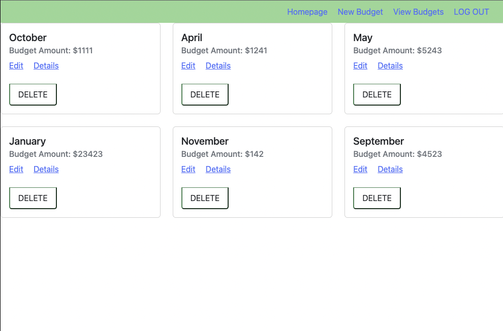

**Title: Budget Time!**

Welcome to the start of your financial freedom. **Why Is a Budget Important? A budget** **helps create financial stability**. By tracking expenses and following a plan, a budget makes it easier to pay bills on time, build an emergency fund, and save for major expenses such as a car or home.

Within this application, you will be able to do just that: easily create new budget months, as the year progresses, and input your expected income for that month.  Once created, you will be able to navigate to the given month and add transactions, either as they happen during the month OR just do them all at once in grouped categories at the end of the month.

The app will track and display the difference between your budget and your expenses, updating live as you input each transaction.

**Screenshots:**

**Technologies Used:**

Javascript, EJS, Express, HTML, Bootstrap, Mongoose, MongoDB, Passport

Planning: [Planning Materials/User Stories/Wireframes](https://trello.com/b/TlMscQmK/project-2-budgetapp-sei-10-31)

**Getting Started:** [Budget Time - CRUD app project](https://cyan-shy-jackrabbit.cyclic.app/)

**Next Steps:**

* Create static expenses that will apear each month without reinputing them
* Show debt/credit cards separately from expenses
* More streamlined categories/sub categories to just click on
* Visual that shows yearly bread down of income vs spending vs investments
